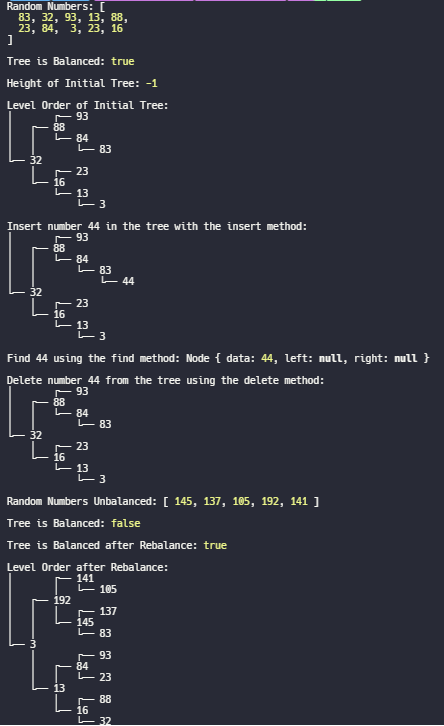

# Binary Search Tree Implementation



This project is part of [The Odin Project](https://www.theodinproject.com/), a comprehensive online curriculum for web development. The goal of this project is to implement a balanced binary search tree (BST) in JavaScript.

A binary search tree is a data structure used to store and manage a collection of elements in a way that allows for efficient searching, insertion, and deletion of elements. It is called a "binary" search tree because each node in the tree has, at most, two children: a left child and a right child.

## Overview

The project consists of a JavaScript implementation of a balanced BST. It includes the following components:

- `Node` class: Represents a node in the binary search tree. Each node contains a data element and references to its left and right children.

- `Tree` class: Represents the binary search tree and provides methods for constructing, inserting, deleting, and rebalancing the tree, as well as various tree traversal methods.

## Features

- Construction of a balanced binary search tree from an array of data.

- Insertion of new elements into the tree while maintaining the binary search tree property.

- Deletion of elements from the tree, considering various cases such as nodes with children.

- Traversal of the tree in different orders: in-order, pre-order, and post-order.

- Calculation of the height and depth of nodes in the tree.

- Checking if the tree is balanced, ensuring that the difference in height between left and right subtrees is not more than 1.

- Rebalancing the tree to maintain its balance and improve performance.

## Getting Started

To use this binary search tree implementation, follow these steps:

1. Clone this repository to your local machine.

2. Install Node.js if you haven't already.

3. Navigate to the project directory in your terminal.

4. Run the provided main script to create, manipulate, and test the binary search tree. You can customize the script as needed for your specific use case.

```shell
node main.js
