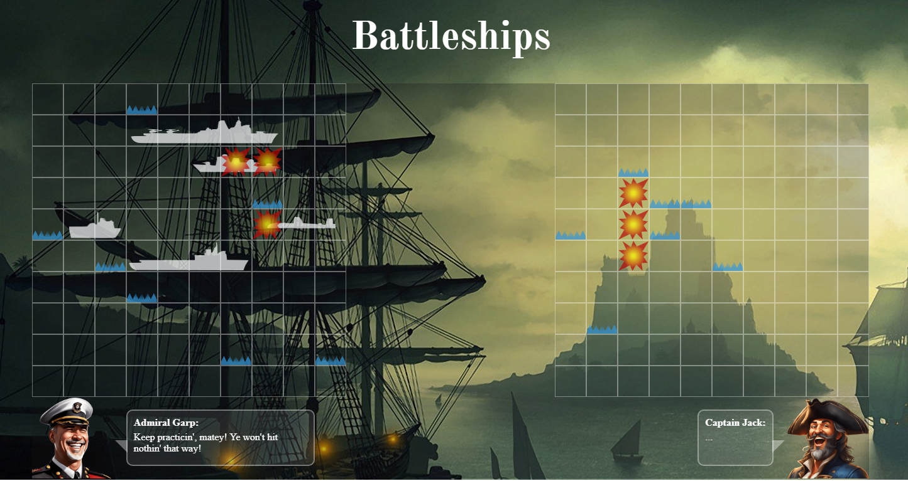

# Battleship Game

A Battleship game project created for [The Odin Project](https://www.theodinproject.com/) curriculum, using vanilla CSS and JavaScript.
## Live Preview
[Live Preview](https://brunoladiv.github.io/TheOdinProject/18-battleship/src/dist/)
## Technologies Used

- HTML
- CSS (Vanilla CSS)
- JavaScript (Vanilla JS)
- [Vitest](https://vitest.dev/) for testing

## To-Do List

- [ ] Improve CPU AI
- [ ] Make the drag and drop feature and interface work on mobile
