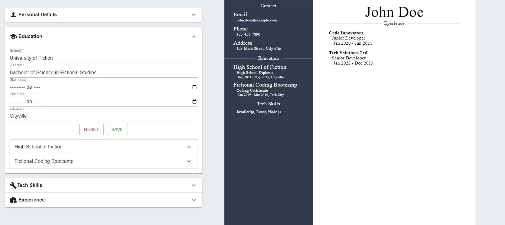

# Odin Academy CV Builder

This project is a CV (Curriculum Vitae) builder developed as part of the curriculum at Odin Project. It utilizes React and `useReducer` to manage state efficiently. The CV builder allows users to create and customize their CVs in a user-friendly interface.

## Table of Contents
- [Technologies](#technologies)
- [Live Preview](#live-preview)

## Technologies

- **React:** A JavaScript library for building user interfaces.
- **useReducer:** A React hook for managing complex state logic in a predictable way.

## Live Preview

Check out the live preview of the project [here](https://the-odin-project-sooty.vercel.app/).

### Todo List

- [ ] Improve interface
- [ ] Simplify state management
