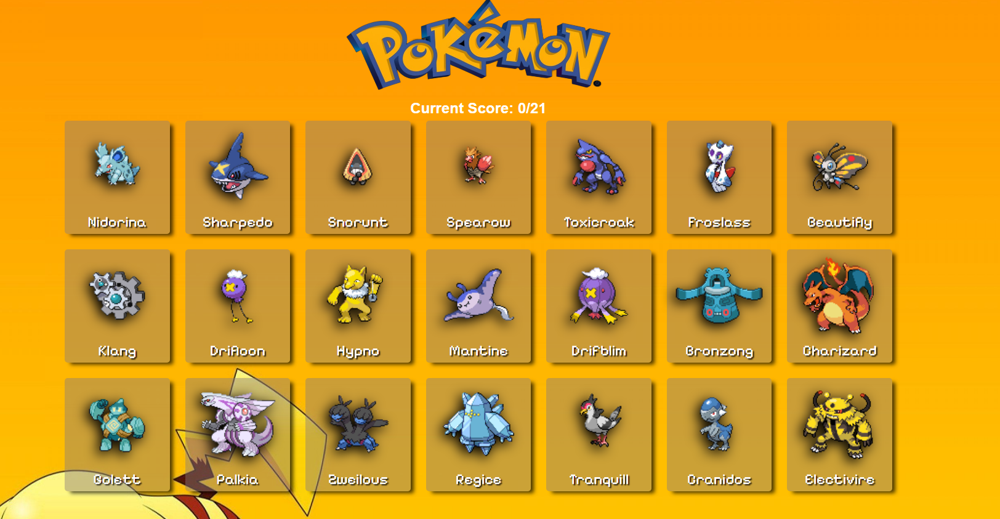

# The Odin Project: Memory Card Game

Welcome to the Pokemon Memory Card Game, a project created as part of TheOdium Project curriculum. This game is built using React, fetching Pokemon data from [PokeAPI](https://pokeapi.co/), and styled components for an engaging user interface.

## Live Preview

Check out the live preview of the game: [Pokemon Memory Card Game](https://brunoladiv.github.io/TheOdinProject/21-memory-card-game/dist)

## Technologies Used

- **React:** The project is built using the React library, providing a modular and efficient way to create user interfaces.

- **PokeAPI:** Pokemon data is fetched from the [PokeAPI](https://pokeapi.co/), allowing for a dynamic and diverse set of cards.

- **Styled Components:** The user interface is styled using the Styled Components library, providing a seamless and responsive design.

## How to Play

**Game Rules:**

- Your goal is to click on each Pokemon card without selecting the same card twice.
- If you click on a card you've already selected, the game is over.
