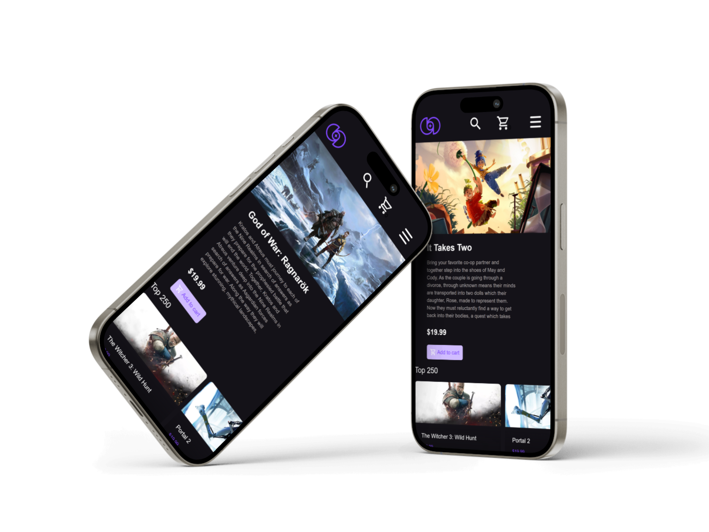

# Shopping Cart Project

This project is a shopping cart application developed as part of The Odin Project's curriculum. It is built using React, React Router, React Query, TypeScript, and Styled Components.

## Live Preview

[View Live Preview](https://brunoladiv.github.io/TheOdinProject/22-shopping-cart/dist/#/)

## Tech Stack

- **React**: The project is built with React, a JavaScript library for building user interfaces.
- **React Router**: Navigation is handled with React Router, providing a seamless and dynamic user experience.
- **React Query**: Data fetching and state management are handled with React Query, making it easy to manage and update data.
- **TypeScript**: The project is written in TypeScript, adding static typing for a more robust and scalable codebase.
- **Styled Components**: Styling is implemented using Styled Components, enabling component-level styling with a more maintainable approach.

## Getting Started

To run the project locally, follow these steps:

1. Clone the repository: `git clone [repository-url]`
2. Navigate to the project directory: `cd shopping-cart-project`
3. Install dependencies: `npm install`
4. Start the development server: `npm start`
5. Open your browser and visit `http://localhost:3000` to view the application.

## To-Do List

- [ ] **Implement Search**: Add a search functionality to allow users to easily find games.
- [ ] **Get game prices from API**: Integrate an external API to fetch real-time prices for games.
- [ ] **Improve Interface**: Enhance the user interface for a more polished and user-friendly experience.

## Acknowledgments

- [The Odin Project](https://www.theodinproject.com/): A free and open-source learning platform for web development.
