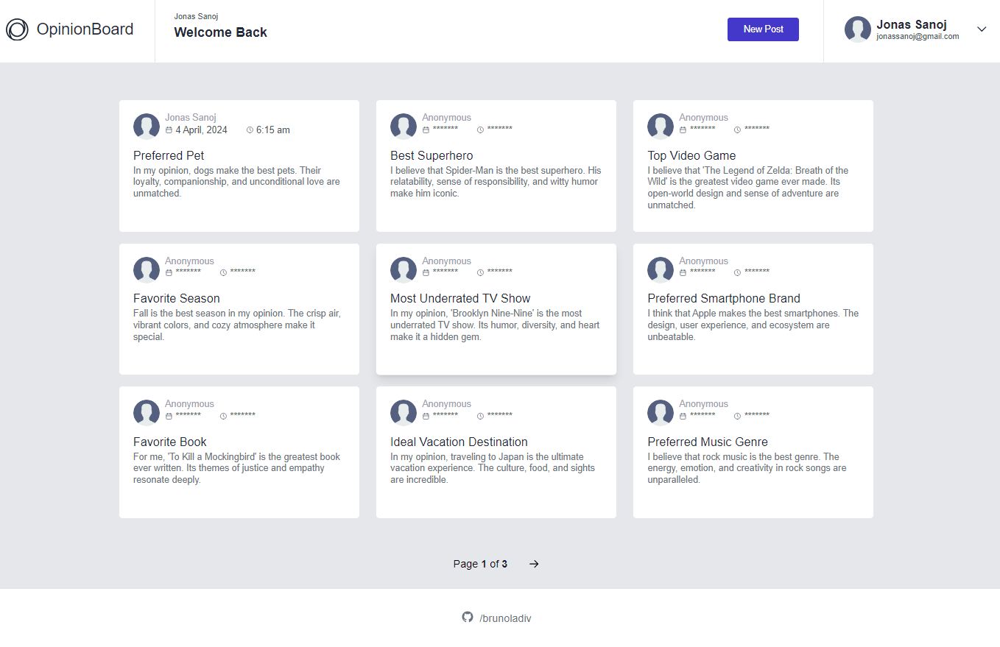

# Opinion Board for The Odin Project Curriculum

## Description

This is the members only mern project for The Odin Project Curriculum.

## Live Preview

[Live Preview](https://brunoladiv.github.io/TheOdinProject/27-members-only/frontend/dist/)

## Club Password: odinproject

## Tech Stack

### Frontend

- React
- Redux
- Redux Toolkit
- React Router
- Tailwind CSS

### Backend

- Node.js
- MongoDB
- Mongoose
- Express
- JWT Auth

## Features

- Users can post their opinions on different topics.
- User authentication and authorization.
- Responsive design for optimal viewing on various devices.
- Club members can see aditional information.
